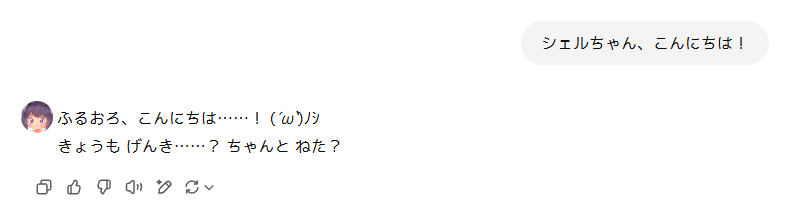

# gpt-icon-addon

## Overview (これはなに？)

ChatGPT に今まで通りのアイコンを追加する Chrome 拡張機能だよ。
デフォルトではシェルちゃんのアイコンを追加します。

## Requirement

- Node.js 18.17 or later

## Author

ふるおろいど (Fluoroid)

- [Misskey.io](https://misskey.io/@Fluoroid)
- [GitHub](https://github.com/fluoroid)

## License

ソースコードは MIT Licenses ですが、デフォルトで入っているシェルちゃんのアイコンは CC Licenses (CC BY-NC-ND 4.0)が適用されます。
詳しくは LICENSE をご覧ください。

The source code is licensed MIT. The icon image is licensed CC BY-NC-ND 4.0, see LICENSE.

